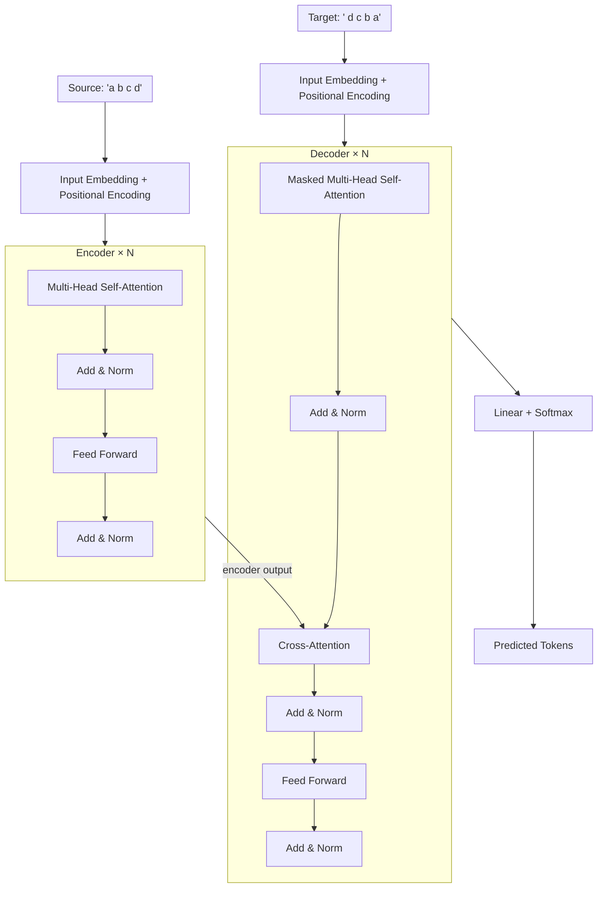

# Vanilla Transformer from Scratch

A clean, from-scratch PyTorch implementation of the full encoder-decoder Transformer architecture as described in ["Attention Is All You Need"](https://arxiv.org/abs/1706.03762) (Vaswani et al., 2017). Every equation in the paper maps to a visible block of code — no black boxes.

**Why this exists:**
- **Grok** the full encoder-decoder transformer (not just decoder-only like GPT)
- **Experiment** with architectural variants from recent research (Pre-LN, RoPE, GQA, SwiGLU, etc.)
- **Visualize** attention patterns to build intuition about what the model learns

A tiny character-level sequence reversal task verifies correctness end-to-end. Trains on CPU in minutes.

---

## Architecture



Following the original paper faithfully — **Post-LN** (LayerNorm after residual add), **ReLU** in FFN, **no weight tying**, **sinusoidal-equivalent learned positions** (easily swappable).

---

## Toy Task: Character-Level Sequence Reversal

| Property | Value |
|----------|-------|
| Task | Reverse a character sequence |
| Example | `"a b c d"` → `"d c b a"` |
| Vocabulary | `a-z` + `<pad>`, `<sos>`, `<eos>`, `<unk>` (30 tokens) |
| Sequence length | Configurable (default 10) |
| Data | Randomly generated; no real dataset needed |
| Why reversal? | Forces the decoder to use cross-attention — cannot solve without attending to the right encoder positions. Cross-attention heatmaps show a clean **anti-diagonal** pattern. |

---

## File Structure

```
llm_from_scratch/
├── config.py          # TransformerConfig dataclass — all hyperparameters in one place
├── embeddings.py      # TokenEmbedding + LearnedPositionalEncoding
├── attention.py       # Scaled dot-product attention + MultiHeadAttention + mask utilities
├── layers.py          # FeedForward, EncoderBlock, DecoderBlock
├── transformer.py     # Encoder, Decoder, Transformer (top-level)
├── data.py            # ReversalDataset, teacher-forcing data prep, collate_fn
├── train.py           # Training loop, checkpointing, sanity checks, logging
├── generate.py        # Greedy autoregressive decoding (interactive + one-shot)
├── visualize.py       # Attention heatmaps + training curves
├── checkpoints/       # Saved .pt checkpoints (per epoch + best model)
├── logs/              # training_log.csv
├── plots/             # Generated figures (loss curves, attention heatmaps)
└── README.md
```

### Why This Split?

Each file isolates one responsibility so you can experiment surgically:

| To try... | Touch only... |
|-----------|---------------|
| Grouped-Query / Flash Attention | `attention.py` |
| RoPE / ALiBi / sinusoidal positions | `embeddings.py` |
| Pre-LN vs Post-LN, SwiGLU, parallel FFN | `layers.py` |
| Encoder-only (BERT) or decoder-only (GPT) | `transformer.py` |
| Sort / copy / tiny translation tasks | `data.py` |
| Deeper/wider model | `config.py` |

---

## Quick Start

### Prerequisites

- Python 3.10+
- PyTorch ≥ 1.12
- numpy, matplotlib, tqdm

```bash
pip install torch numpy matplotlib tqdm
```

### Training

```bash
# Fresh start (cleans checkpoints/ and logs/)
python train.py

# Resume from a checkpoint
python train.py --resume checkpoints/ckpt_epoch_005.pt
```

Training takes **< 5 minutes** on a modern CPU with the default tiny config (128-dim model, 3 encoder/decoder layers, 4 heads). You should reach **> 95% exact-match accuracy** within a few epochs.

### Inference

```bash
# Interactive mode — type strings to reverse
python generate.py --checkpoint checkpoints/best.pt

# One-shot reversal
python generate.py --checkpoint checkpoints/best.pt --input "hello"
```

### Visualization

```bash
# Plot training curves + attention heatmaps
python visualize.py --checkpoint checkpoints/best.pt --log logs/training_log.csv

# Visualize attention for a specific input
python visualize.py --checkpoint checkpoints/best.pt --input "abcde"
```

For the reversal task, cross-attention heatmaps should reveal an **anti-diagonal** pattern — decoder position `i` attends to encoder position `seq_len - i - 1`.

---

## Default Configuration

| Parameter | Value | Paper | Rationale |
|-----------|-------|-------|-----------|
| `d_model` | 128 | 512 | Small for CPU; still large enough for 4 heads |
| `num_heads` | 4 | 8 | `d_model` ÷ `num_heads` = 32 per head |
| `d_ff` | 512 | 2048 | 4× multiplier (paper convention) |
| `num_encoder_layers` | 3 | 6 | 3 layers is plenty for reversal |
| `num_decoder_layers` | 3 | 6 | Same |
| `dropout` | 0.1 | 0.1 | Paper default |
| `vocab_size` | 30 | varies | 26 chars + 4 special tokens |
| `batch_size` | 64 | varies | Fits CPU memory comfortably |
| `learning_rate` | 1e-4 | varies | Adam optimizer |
| `epochs` | 20 | varies | Reversal converges quickly |

Override any parameter:

```python
from config import TransformerConfig
cfg = TransformerConfig(d_model=256, num_encoder_layers=4, num_epochs=30)
```

---

## Checkpoint Format

Checkpoints are single `.pt` files containing everything needed to resume training or run inference:

```python
checkpoint = {
    'epoch':               epoch,
    'step':                global_step,
    'model_state_dict':    model.state_dict(),
    'optimizer_state_dict': optimizer.state_dict(),
    'config':              dataclasses.asdict(config),
    'train_losses':        [...],
    'val_losses':          [...],
    'best_val_loss':       float,
}
```

- **Fresh start** (`python train.py`): wipes `checkpoints/` and `logs/`, starts clean.
- **Resume** (`python train.py --resume path.pt`): restores model weights, optimizer state (Adam momentum), and all metrics. Picks up exactly where it left off.

---

## Sanity Checks

Before full training, the pipeline runs three automated checks to catch ~90% of implementation bugs early:

1. **Shape test** — verify every tensor shape against the reference table in `SPEC.md`
2. **Causal mask test** — confirm decoder self-attention mask is lower-triangular
3. **Overfit test** — train on a single batch of 4 examples; model should memorize to 100% accuracy within a few hundred steps

---

## Experimentation Roadmap

Once the vanilla implementation is solid, here are paper-aligned variants to try:

| Experiment | What Changes | Key File(s) |
|------------|-------------|-------------|
| **Pre-LN** | LayerNorm before sublayer (GPT/LLaMA style) | `layers.py` |
| **Sinusoidal PE** | Fixed sine/cosine instead of learned | `embeddings.py` |
| **GELU / SwiGLU** | Replace ReLU in feed-forward | `layers.py` |
| **Weight Tying** | Share embeddings across encoder, decoder, lm_head | `transformer.py` |
| **Grouped-Query Attention (GQA)** | Fewer KV heads than Q heads | `attention.py` |
| **Rotary Position Embedding (RoPE)** | Rotate Q, K before attention scores | `attention.py` + `embeddings.py` |
| **Flash Attention** | Fused memory-efficient attention kernel | `attention.py` |
| **Parallel Attention + FFN** | Remove sequential dependency in block | `layers.py` |
| **Encoder-Only (BERT)** | Remove decoder, add masked LM head | new file + `transformer.py` |
| **Decoder-Only (GPT)** | Remove encoder, causal self-attention only | `transformer.py` |
| **New Toy Tasks** | Sort, copy, tiny translation, arithmetic | `data.py` |
| **Real Text Data** | Swap character dataset for tokenized corpora | `data.py` |

---

## References

- Vaswani et al., ["Attention Is All You Need"](https://arxiv.org/abs/1706.03762) (2017)
- The Annotated Transformer (Harvard NLP) — [nlp.seas.harvard.edu/annotated-transformer](http://nlp.seas.harvard.edu/annotated-transformer/)
- Jay Alammar, ["The Illustrated Transformer"](https://jalammar.github.io/illustrated-transformer/)

---

*Built for learning. Hack it, break it, rebuild it.*
